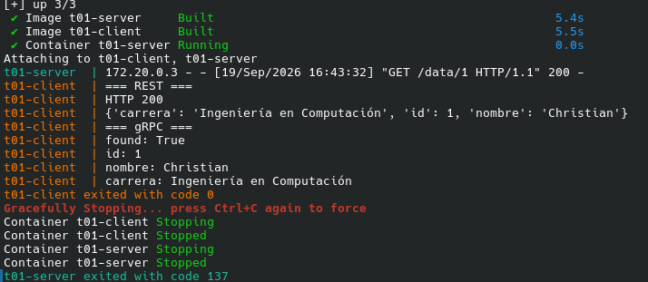
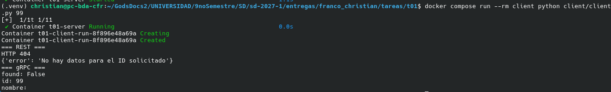

## 1. Objetivo

Implementar un servicio que permita consultar información asociada a un ID y exponer la misma lógica de negocio mediante dos interfaces de comunicación:

- REST sobre HTTP.
- gRPC mediante Protocol Buffers.

El servidor y el cliente se ejecutan mediante Docker Compose y se comunican a través de una red Docker.

---

## 2. Arquitectura

La aplicación separa la lógica de negocio de las interfaces de comunicación.

La función `obtener_dato(id)` se encuentra en `server/logic.py` y es utilizada tanto por el controlador REST como por el servidor gRPC.

De esta manera, ambas interfaces utilizan la misma lógica de negocio y únicamente cambia el mecanismo utilizado para recibir y responder las solicitudes.

---

## 3. Lógica de negocio compartida

El archivo `server/logic.py` contiene los datos de prueba y la función encargada de realizar la consulta:

```python
datos = {
    1: {
        "nombre": "Christian",
        "carrera": "Ingeniería en Computación"
    },
    2: {
        "nombre": "Alice",
        "carrera": "Inteligencia Artificial"
    },
    3: {
        "nombre": "UNAM",
        "carrera": "Universidad"
    }
}


def obtener_dato(id):
    return datos.get(id)
```

La misma función es utilizada desde las dos interfaces.

En REST:

```python
dato = obtener_dato(id)
```

En gRPC:

```python
dato = obtener_dato(request.id)
```

Esto evita implementar dos veces la lógica de consulta.

---

## 4. Definición del servicio gRPC

El contrato del servicio se definió mediante Protocol Buffers en `proto/data.proto`:

```protobuf
syntax = "proto3";

package data;

service DataService {
  rpc GetData(GetDataRequest) returns (GetDataResponse);
}

message GetDataRequest {
  int32 id = 1;
}

message GetDataResponse {
  bool found = 1;
  int32 id = 2;
  string nombre = 3;
  string carrera = 4;
}
```

El método `GetData` recibe un ID y devuelve la información correspondiente junto con un indicador que permite determinar si el registro fue encontrado.

---

## 5. Prueba con un ID existente

Se levantó el proyecto mediante Docker Compose:

```bash
docker compose up --build
```

La ejecución mostró que el servidor inició Flask y que el cliente pudo comunicarse con él:

```text
t01-server | * Serving Flask app 'app'
t01-server | * Debug mode: off
t01-server | * Running on all addresses (0.0.0.0)
t01-server | * Running on http://127.0.0.1:5000
t01-server | * Running on http://172.20.0.2:5000

t01-server | 172.20.0.3 - - [19/Sep/2026 16:32:52] "GET /data/1 HTTP/1.1" 200 -

t01-client | === REST ===
t01-client | HTTP 200
t01-client | {'carrera': 'Ingeniería en Computación', 'id': 1, 'nombre': 'Christian'}

t01-client | === gRPC ===
t01-client | found: True
t01-client | id: 1
t01-client | nombre: Christian
t01-client | carrera: Ingeniería en Computación

t01-client exited with code 0
```


### Resultado

Para el ID `1`, ambas interfaces devolvieron correctamente la información asociada:

```text
ID:       1
Nombre:   Christian
Carrera:  Ingeniería en Computación
```

REST respondió mediante HTTP con código `200`, mientras que gRPC indicó `found: True` y devolvió los mismos datos.

---

## 6. Prueba con un ID inexistente

Se realizó una segunda prueba utilizando el ID `99`, que no existe en los datos del servicio:

```bash
docker compose run --rm client python client/client.py 99
```

Resultado obtenido:

```text
=== REST ===
HTTP 404
{'error': 'No hay datos para el ID solicitado'}

=== gRPC ===
found: False
id: 99
nombre:
carrera:
```

### Resultado

Las dos interfaces detectaron correctamente que el ID no existe.

REST respondió con código HTTP `404` y un mensaje indicando que no existen datos para el ID solicitado.

gRPC respondió con:

```text
found: False
id: 99
```

Por lo tanto, ambas interfaces presentan un comportamiento consistente ante un ID inexistente.



---

## 7. Contenedores y comunicación mediante Docker

El proyecto utiliza Docker Compose para ejecutar el servidor y el cliente dentro de una red compartida denominada `t01-network`.

La red fue inspeccionada mediante:

```bash
docker network inspect t01_t01-network
```

Entre los datos obtenidos se encuentra:

```text
"Name": "t01_t01-network"
"Driver": "bridge"
"Subnet": "172.20.0.0/16"
"Gateway": "172.20.0.1"
```

El servidor se encontraba conectado a esta red:

```text
"Name": "t01-server"
"IPv4Address": "172.20.0.2/16"
```

Durante la ejecución de Docker Compose, el servidor recibió una petición desde el cliente mediante la red interna:

```text
t01-server | 172.20.0.3 - - [19/Sep/2026 16:32:52] "GET /data/1 HTTP/1.1" 200 -
```

La dirección `172.20.0.3` corresponde al cliente dentro de la red Docker, mientras que el servidor utilizó la dirección `172.20.0.2`.

Esto demuestra la comunicación entre los contenedores mediante la red definida en Docker Compose.

---

## 8. Puertos utilizados

El servidor expone dos puertos:

| Interfaz | Puerto | Protocolo |
|---|---:|---|
| REST | 5000 | HTTP |
| gRPC | 50051 | HTTP/2 + Protocol Buffers |

La ejecución de `docker compose ps` mostró los puertos publicados:

```text
0.0.0.0:5000->5000/tcp
0.0.0.0:50051->50051/tcp
```

---

## 9. Componentes entregados

La implementación está organizada de la siguiente manera:

```text
t01/
├── server/
│   ├── app.py
│   ├── grpc_server.py
│   ├── logic.py
│   ├── requirements.txt
│   └── Dockerfile
│
├── client/
│   ├── client.py
│   ├── requirements.txt
│   └── Dockerfile
│
├── proto/
│   ├── data.proto
│   ├── data_pb2.py
│   ├── data_pb2_grpc.py
│   └── __init__.py
│
├── compose.yaml
├── evidencia.md
└── README.md
```

Se cuenta con:

- Servidor REST.
- Servidor gRPC.
- Lógica de negocio compartida.
- Cliente capaz de utilizar REST y gRPC.
- Definición `.proto`.
- Dockerfile para servidor.
- Dockerfile para cliente.
- Docker Compose.
- Red Docker para la comunicación entre servicios.
- Evidencia de funcionamiento.

---

## 10. Conclusión

La implementación cumple con el objetivo de exponer un mismo servicio mediante REST y gRPC.

Ambas interfaces utilizan la función `obtener_dato()` como lógica de negocio común, evitando duplicar la implementación.

Las pruebas realizadas demostraron el funcionamiento para un ID existente y para un ID inexistente. Además, Docker Compose permitió ejecutar los componentes en contenedores separados y establecer comunicación entre ellos mediante una red Docker compartida.


