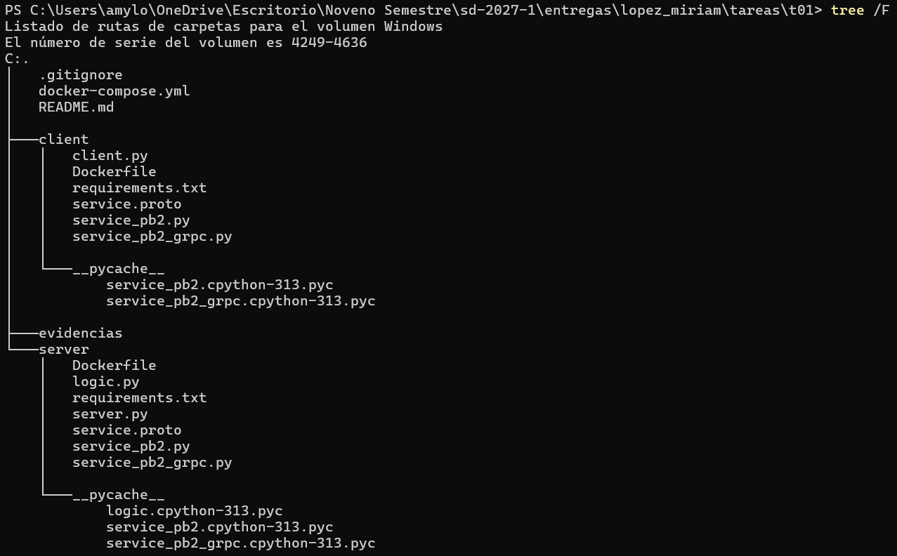
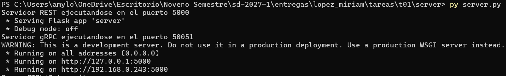
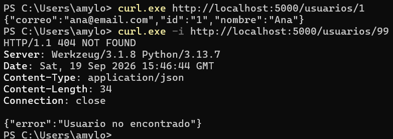
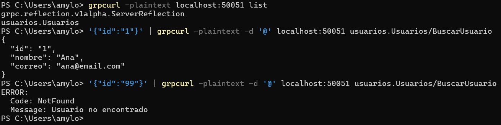
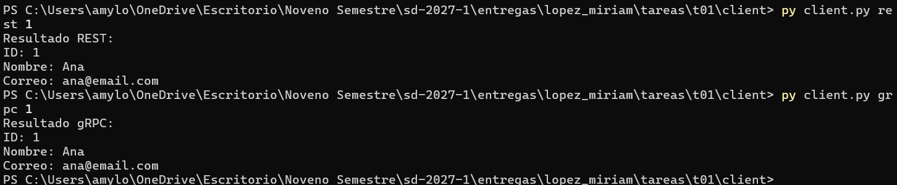
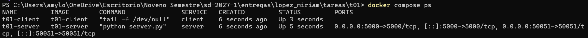
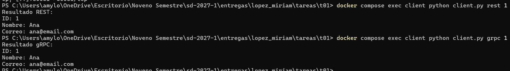

# T01 - REST y gRPC

## Descripción

En esta tarea hice un solo servicio que se puede consultar de dos formas diferentes: usando REST y usando gRPC.
La idea principal fue que los dos usaran la misma lógica y no hacer dos programas diferentes.
El servicio que hice busca información de usuarios por medio de un ID.

Por ejemplo:
ID 1 -> Ana
ID 2 -> Luis
ID 3 -> Maria

Si se manda un ID que no existe, el servicio responde que el usuario no fue encontrado.

---

## Estructura del proyecto

La estructura final de la tarea quedó así:



---

# Lógica del servicio

La lógica está en el archivo:

```text
server/logic.py
```

Ahí guardé algunos usuarios en un diccionario y creé una función llamada:

```text
buscar_usuario(id)
```

Esta función busca al usuario por su ID.
Lo importante es que tanto REST como gRPC usan esa misma función.
Entonces el funcionamiento es más o menos así:

```text
REST ----\
          -> buscar_usuario(id)
gRPC ----/
```

De esta forma no se repite la lógica.

---

# Servidor

El archivo:

```text
server/server.py
```

levanta los dos servicios al mismo tiempo.
REST funciona en el puerto:

```text
5000
```

y gRPC funciona en:

```text
50051
```

### Evidencia del servidor funcionando



---

# REST

Para REST hice la siguiente ruta:

```text
GET /usuarios/<id>
```

Por ejemplo:

```text
GET /usuarios/1
```

devuelve:

```json
{
  "id": "1",
  "nombre": "Ana",
  "correo": "ana@email.com"
}
```

Si el usuario no existe, responde con:

```json
{
  "error": "Usuario no encontrado"
}
```

y utiliza el código:

```text
404 NOT FOUND
```

---

## Prueba de REST

Para probar REST utilicé:

```powershell
curl.exe http://localhost:5000/usuarios/1
```

También probé un ID que no existe:

```powershell
curl.exe -i http://localhost:5000/usuarios/99
```

Con esto pude comprobar que el servicio funciona correctamente y que también maneja el error cuando no encuentra al usuario.

### Evidencia de REST



---

# gRPC

Para gRPC utilicé el archivo:

```text
service.proto
```

Dentro de este archivo se define el servicio `Usuarios` y la operación:

```text
BuscarUsuario
```

La operación recibe un ID y regresa los datos del usuario.

El contrato quedó así:

```proto
syntax = "proto3";

package usuarios;

service Usuarios {
  rpc BuscarUsuario (UsuarioRequest) returns (UsuarioResponse);
}

message UsuarioRequest {
  string id = 1;
}

message UsuarioResponse {
  string id = 1;
  string nombre = 2;
  string correo = 3;
}
```

A partir de este archivo se generaron:

```text
service_pb2.py
service_pb2_grpc.py
```

---

## Prueba de gRPC

Primero revisé los servicios disponibles con:

```powershell
grpcurl -plaintext localhost:50051 list
```

Después probé un usuario existente:

```powershell
'{"id":"1"}' | grpcurl -plaintext -d '@' localhost:50051 usuarios.Usuarios/BuscarUsuario
```

También probé un usuario que no existe:

```powershell
'{"id":"99"}' | grpcurl -plaintext -d '@' localhost:50051 usuarios.Usuarios/BuscarUsuario
```

Para el ID que no existe, gRPC responde con un error `NotFound`.

### Evidencia de gRPC



---

# Cliente

También hice un cliente que puede hacer las dos consultas.

El cliente se encuentra en:

```text
client/client.py
```

Para usar REST se ejecuta:

```powershell
py client.py rest 1
```

Para usar gRPC:

```powershell
py client.py grpc 1
```

En los dos casos se consulta el mismo usuario.

Por ejemplo:

```text
ID: 1
Nombre: Ana
Correo: ana@email.com
```

### Evidencia del cliente



---

# Docker

También hice un `Dockerfile` para el servidor y otro para el cliente.

El servidor expone los dos puertos:

```text
5000
50051
```

El cliente también se ejecuta dentro de Docker para hacer las pruebas.

---

# Docker Compose

Para levantar el servidor y el cliente al mismo tiempo utilicé:

```powershell
docker compose up --build -d
```

Después revisé que los dos contenedores estuvieran funcionando con:

```powershell
docker compose ps
```

Los contenedores son:

```text
t01-server
t01-client
```

### Evidencia de Docker Compose



---

# Prueba del cliente dentro de Docker

También probé que el cliente pudiera comunicarse con el servidor estando los dos dentro de Docker.

Para REST utilicé:

```powershell
docker compose exec client python client.py rest 1
```

Para gRPC:

```powershell
docker compose exec client python client.py grpc 1
```

En los dos casos se obtuvo el mismo usuario:

```text
ID: 1
Nombre: Ana
Correo: ana@email.com
```

### Evidencia del cliente en Docker



---

# Funcionamiento general

El funcionamiento final quedó así:

```text
                 REST
                  |
                  v
cliente ------> server.py ------> logic.py
                  ^
                  |
                 gRPC
```

REST y gRPC tienen diferente forma de comunicación, pero los dos terminan usando la misma lógica.

---

# Conclusión

En esta tarea pude hacer un solo servidor que funciona con REST y con gRPC.
Al principio pensé que se tenían que hacer dos servicios separados, pero después entendí que la idea era tener una sola lógica y poder acceder a ella de dos formas diferentes.
También hice un cliente que puede elegir si quiere comunicarse por REST o por gRPC.
REST se me hizo más sencillo de probar porque se puede usar directamente `curl`, mientras que en gRPC se necesita el archivo `.proto` y usar herramientas como `grpcurl`.
Al final también logré correr todo con Docker y Docker Compose y comprobar que tanto REST como gRPC regresan la misma información.
Esta tarea me ayudó a entender mejor que se puede cambiar la forma en la que se comunican los programas sin tener que repetir toda la lógica.