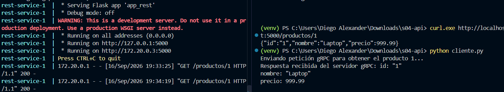
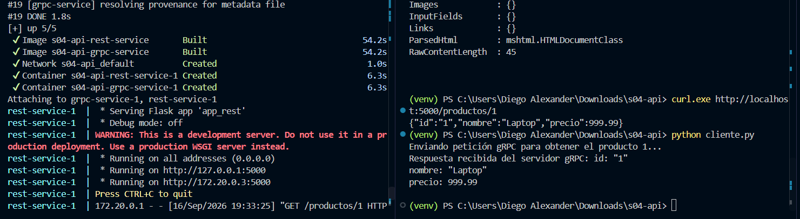

# T01: El mismo servicio por REST y por gRPC

Este proyecto implementa un servicio único de consulta y creación de productos expuesto mediante dos interfaces de comunicación distintas: **REST (JSON sobre HTTP/1.1)** y **gRPC (Protobuf sobre HTTP/2)**.

---

##  Arquitectura y Diseño

Para cumplir con el requerimiento central de **lógica compartida**, la aplicación no se dividió en dos programas independientes. En su lugar, el modelo de datos y la gestión de la "base de datos" en memoria están desacoplados del mecanismo de transporte. 

* **Lógica Core (`logica.py` / controlador interno):** Contiene las funciones de búsqueda y almacenamiento de productos.
* **Controlador REST (`app_rest.py`):** Serializa la respuesta a JSON y maneja códigos de estado HTTP (200, 201, 404).
* **Controlador gRPC (`app_grpc.py`):** Mapea las estructuras generadas por Protobuf y gestiona las llamadas RPC binarias.

---

##  Evidencias de Funcionamiento

### Pruebas de ejecución local / contenedor:


*Figura 1: Petición HTTP GET a la API REST retornando payload en formato JSON.*


*Figura 2: Petición RPC usando el cliente gRPC sobre el puerto binario 50051.*

---

##  Cómo levantar el proyecto con Docker

El proyecto cuenta con sus respectivos `Dockerfile` y un archivo `docker-compose.yml` que orquesta la red de contenedores.

```bash
# Construir y levantar los servicios en segundo plano o interactivo
docker-compose up --build