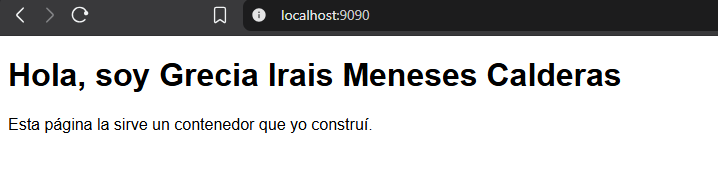
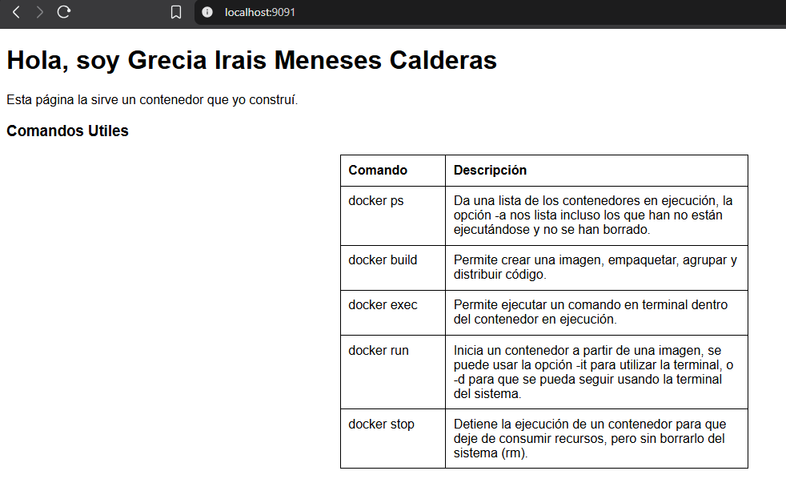

# Docker, D01:

## Comandos Utilizados

```
PS C:\sd-2027-1\entregas\meneses_grecia> docker --version
Docker version 29.7.2, build a7dcaa6
PS C:\sd-2027-1\entregas\meneses_grecia> docker pull nginx:alpine
alpine: Pulling from library/nginx
Status: Downloaded newer image for nginx:alpine
docker.io/library/nginx:alpine
PS C:\sd-2027-1\entregas\meneses_grecia> docker images
IMAGE                ID             DISK USAGE   CONTENT SIZE   EXTRA
hello-world:latest   5dd0d3e6e255       25.9kB         9.49kB    U
nginx:alpine         72ba65eb42c1        103MB         29.7MB
PS C:\sd-2027-1\entregas\meneses_grecia> docker run -d --name web1 nginx:alpine
PS C:\sd-2027-1\entregas\meneses_grecia> docker run -d --name web2 nginx:alpine
PS C:\sd-2027-1\entregas\meneses_grecia> docker ps
CONTAINER ID   IMAGE          COMMAND                  CREATED          STATUS          PORTS     NAMES
cce1eeb72d0f   nginx:alpine   "/docker-entrypoint.…"   17 seconds ago   Up 17 seconds   80/tcp    web2
9bd837ec20e2   nginx:alpine   "/docker-entrypoint.…"   24 seconds ago   Up 23 seconds   80/tcp    web1
PS C:\sd-2027-1\entregas\meneses_grecia> docker stop web1
web1
PS C:\sd-2027-1\entregas\meneses_grecia> docker ps
CONTAINER ID   IMAGE          COMMAND                  CREATED          STATUS          PORTS     NAMES
cce1eeb72d0f   nginx:alpine   "/docker-entrypoint.…"   49 seconds ago   Up 49 seconds   80/tcp    web2
PS C:\sd-2027-1\entregas\meneses_grecia> docker ps -a
CONTAINER ID   IMAGE          COMMAND                  CREATED          STATUS                     PORTS     NAMES
cce1eeb72d0f   nginx:alpine   "/docker-entrypoint.…"   52 seconds ago   Up 51 seconds              80/tcp    web2
9bd837ec20e2   nginx:alpine   "/docker-entrypoint.…"   59 seconds ago   Exited (0) 4 seconds ago             web1
3ff2a69e84e5   hello-world    "/hello"                 7 hours ago      Exited (0) 7 hours ago               exciting_cohen
PS C:\sd-2027-1\entregas\meneses_grecia> docker start web1
PS C:\sd-2027-1\entregas\meneses_grecia> docker ps
CONTAINER ID   IMAGE          COMMAND                  CREATED              STATUS              PORTS     NAMES
cce1eeb72d0f   nginx:alpine   "/docker-entrypoint.…"   About a minute ago   Up About a minute   80/tcp    web2
9bd837ec20e2   nginx:alpine   "/docker-entrypoint.…"   About a minute ago   Up 5 seconds        80/tcp    web1
PS C:\sd-2027-1\entregas\meneses_grecia> docker run -it --rm alpine sh
Status: Downloaded newer image for alpine:latest
/ # cat /etc/os-release
NAME="Alpine Linux"
ID=alpine
VERSION_ID=3.24.1
PRETTY_NAME="Alpine Linux v3.24"
HOME_URL="https://alpinelinux.org/"
BUG_REPORT_URL="https://gitlab.alpinelinux.org/alpine/aports/-/issues"
/ # ps aux
PID   USER     TIME  COMMAND
    1 root      0:00 sh
    8 root      0:00 ps aux
/ # exit
PS C:\sd-2027-1\entregas\meneses_grecia> docker run -d -p 8080:80 --name miweb nginx:alpine
PS C:\sd-2027-1\entregas\meneses_grecia> docker run -d -p 8080:80 --name choque nginx:alpine
PS C:\sd-2027-1\entregas\meneses_grecia> docker exec -it miweb sh
/ # ls /usr/share/nginx/html
50x.html    index.html
/ # exit
PS C:\sd-2027-1\entregas\meneses_grecia> docker logs miweb
...
2026/09/05 13:18:58 [notice] 1#1: start worker process 37
172.17.0.1 - - [05/Sep/2026:13:19:49 +0000] "GET / HTTP/1.1" 200 896 "-" "Mozilla/5.0 (Windows NT 10.0; Win64; x64) AppleWebKit/537.36 (KHTML, like Gecko) Chrome/152.0.0.0 Safari/537.36" "-"
172.17.0.1 - - [05/Sep/2026:13:19:49 +0000] "GET /favicon.ico HTTP/1.1" 404 555 "http://localhost:8080/" "Mozilla/5.0 (Windows NT 10.0; Win64; x64) AppleWebKit/537.36 (KHTML, like Gecko) Chrome/152.0.0.0 Safari/537.36" "-"
2026/09/05 13:19:49 [error] 31#31: *1 open() "/usr/share/nginx/html/favicon.ico" failed (2: No such file or directory), client: 172.17.0.1, server: localhost, request: "GET /favicon.ico HTTP/1.1", host: "localhost:8080", referrer: "http://localhost:8080/"

PS C:\Users\gmene\Documents\9no\sd-2027-1\entregas\meneses_grecia\s02> docker build -t mi-sitio .
[+] Building 2.1s (7/7) FINISHED                                                                docker:desktop-linux
...
 => [2/2] COPY index.html /usr/share/nginx/html/index.html                                                      0.1s
...
 => => unpacking to docker.io/library/mi-sitio:latest                                                           0.1s
PS C:\sd-2027-1\entregas\meneses_grecia\s02> docker images
IMAGE                ID             DISK USAGE   CONTENT SIZE   EXTRA
alpine:latest        28bd5fe8b56d         13MB         3.93MB
hello-world:latest   5dd0d3e6e255       25.9kB         9.49kB    U
mi-sitio:latest      371aec5fc7b6        102MB         28.8MB
nginx:alpine         72ba65eb42c1        103MB         29.7MB    U
PS C:\Users\gmene\Documents\9no\sd-2027-1\entregas\meneses_grecia\s02> docker run -d -p 9090:80 --name sitio mi-sitio
```




### Práctica 

```
PS C:\sd-2027-1\entregas\meneses_grecia\s02> docker build -t mi-sitio:v2 .
[+] Building 1.5s (7/7) FINISHED                                                                   docker:desktop-linux
...

PS C:\sd-2027-1\entregas\meneses_grecia\s02> docker ps
CONTAINER ID   IMAGE          COMMAND                  CREATED             STATUS             PORTS                                     NAMES
5dbb52255e5e   mi-sitio:v2    "/docker-entrypoint.…"   2 minutes ago       Up 2 minutes       0.0.0.0:9091->80/tcp, [::]:9091->80/tcp   sitiov2
5e0b2457f367   mi-sitio       "/docker-entrypoint.…"   50 minutes ago      Up 50 minutes      0.0.0.0:9090->80/tcp, [::]:9090->80/tcp   sitio
6483ed54933c   nginx:alpine   "/docker-entrypoint.…"   About an hour ago   Up About an hour   0.0.0.0:8080->80/tcp, [::]:8080->80/tcp   miweb
cce1eeb72d0f   nginx:alpine   "/docker-entrypoint.…"   About an hour ago   Up About an hour   80/tcp                                    web2
9bd837ec20e2   nginx:alpine   "/docker-entrypoint.…"   About an hour ago   Up About an hour   80/tcp       
```

#### Error Exposición de puerto
```
PS C:\sd-2027-1\entregas\meneses_grecia\s02> docker run -d -p 9090:80 --name sitiov2 mi-sitio:v2
7c9274dee25b8df5219359f0f6280f491533acf7f7a2b2c2c19206e10f7469f8

What's next:
    Debug this container error with Gordon → docker ai "help me fix this container error"
docker: Error response from daemon: failed to set up container networking: driver failed programming external connectivity on endpoint sitiov2 (e266c1bd625fb39e0b5f1e75c0f5c9469f5ecf359c934c7bea69481245928063): Bind for 0.0.0.0:9090 failed: port is already allocated

Run 'docker run --help' for more information
```

#### Corrección y resultados
```
PS C:\sd-2027-1\entregas\meneses_grecia\s02> docker run -d -p 9091:80 --name sitiov2 mi-sitio:v2
```



#### Borrado del contenedor anterior

```
PS C:\sd-2027-1\entregas\meneses_grecia\s02> docker stop sitio
PS C:\sd-2027-1\entregas\meneses_grecia\s02> docker rm sitio

PS C:\sd-2027-1\entregas\meneses_grecia\s02> docker ps -a
CONTAINER ID   IMAGE          COMMAND                  CREATED             STATUS                   PORTS                                     NAMES
f7828e866ba0   mi-sitio:v2    "/docker-entrypoint.…"   2 minutes ago       Up 2 minutes             0.0.0.0:9091->80/tcp, [::]:9091->80/tcp   sitiov2
443639f88555   nginx:alpine   "/docker-entrypoint.…"   About an hour ago   Created                                                            choque
6483ed54933c   nginx:alpine   "/docker-entrypoint.…"   About an hour ago   Up About an hour         0.0.0.0:8080->80/tcp, [::]:8080->80/tcp   miweb
cce1eeb72d0f   nginx:alpine   "/docker-entrypoint.…"   About an hour ago   Up About an hour         80/tcp                                    web2
9bd837ec20e2   nginx:alpine   "/docker-entrypoint.…"   About an hour ago   Up About an hour         80/tcp                                    web1
3ff2a69e84e5   hello-world    "/hello"                 9 hours ago         Exited (0) 9 hours ago                                             exciting_cohen
```

## ¿Por qué no cambió la página sin reconstruir?

Los cambios no corren dinámicamente al cambiar algo del archivo porque se realiza una copia de los archivos
indicados en ese momento (indicado en el Dockerfile) y se tiene que volver a cargar o construir la imagen con el contenido actualizado y exponerlo al puerto para que se vean reflejados los cambios.

## ¿Qué comparten y qué no dos contenedores de la misma imagen?

No comparten los cambios posteriores a construir la imagen que se hayan hecho, ni pueden ver los cambios hechos de un contenedor a otro, tienen diferentes procesos y su propia configuración o identidad de red, y su propio estado.

Mientras que, sí comparten la base de la que fueron construidas y el kernel.


