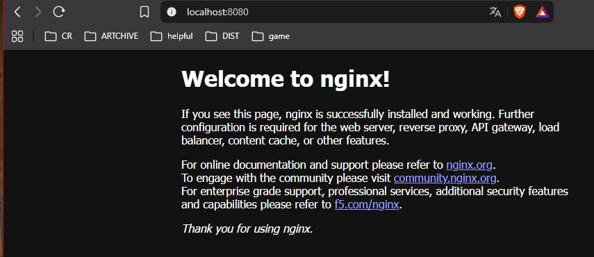
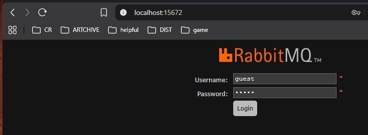
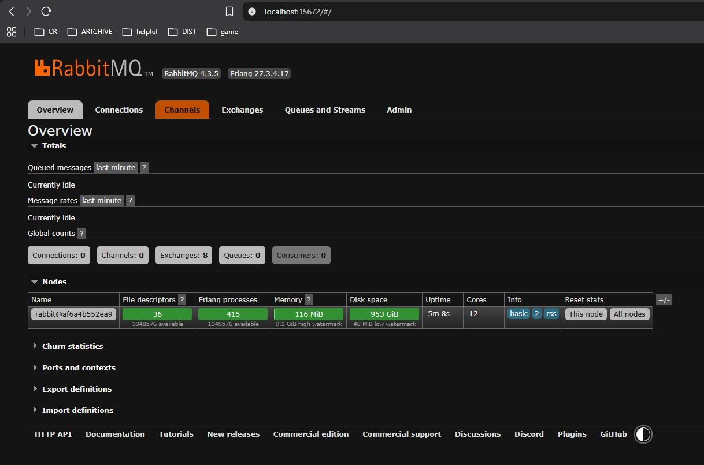
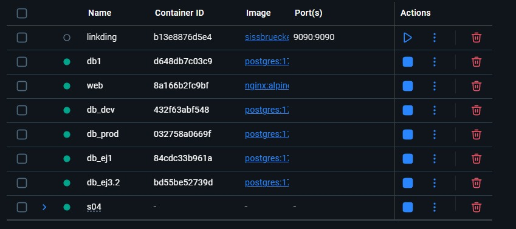

# Docker, día dos: estado, red, configuración y compose

## Misión 1. Persistencia

*Demuestra, con las salidas pegadas como texto, que una fila sobrevive a docker rm -f cuando hay volumen y no sobrevive cuando no lo hay. Las dos corridas, el ERROR incluido.*


Primero, se carga la imagen de postgres.

```
PS C:\sd-2027-1\entregas\meneses_grecia\s04> docker pull postgres:17-alpine
```

Después, se corre un contenedor y se le da un nombre: 

```
PS C:\sd-2027-1\entregas\meneses_grecia\s04> docker run -d --name db1 -e POSTGRES_PASSWORD=secreto postgres:17-alpine
```

El contenedor se crea sin volumen y dentro de la terminal de postgres se crea una tabla, se inserta un valor, y se verifica que la operación se realizó correctamente.
```
PS C:\sd-2027-1\entregas\meneses_grecia\s04> docker exec -it db1 psql -U postgres -c "CREATE TABLE cuentas(id int primary key, saldo int);"
CREATE TABLE
PS C:\sd-2027-1\entregas\meneses_grecia\s04> docker exec -it db1 psql -U postgres -c "INSERT INTO cuentas VALUES(1, 100);"
INSERT 0 1
PS C:\sd-2027-1\entregas\meneses_grecia\s04> docker exec -it db1 psql -U postgres -c "SELECT * FROM cuentas;"
 id | saldo
----+-------
  1 |   100
(1 row)
```

Como siguiente paso, se borra el contenedor y se vuelve a crear sin volumen, y se hace una consulta a la tabla creada anteriormente, lo cual salta un error.
```
PS C:\sd-2027-1\entregas\meneses_grecia\s04> docker rm -f db1
db1
PS C:\sd-2027-1\entregas\meneses_grecia\s04> docker run -d --name db1 -e POSTGRES_PASSWORD=secreto postgres:17-alpine
PS C:\sd-2027-1\entregas\meneses_grecia\s04> docker exec -it db1 psql -U postgres -c "SELECT * FROM cuentas;"
ERROR:  relation "cuentas" does not exist
LINE 1: SELECT * FROM cuentas;
                      ^
```

Para demostrar que la información dentro del contenedor puede sobrevivir, borramos el contenedor anterior y creamos otro pero ahora con un volumen llamado datos_banco e indicando la ruta absoluta donde se guardarán los datos. 
```
PS C:\sd-2027-1\entregas\meneses_grecia\s04> docker rm -f db1
db1
PS C:\sd-2027-1\entregas\meneses_grecia\s04> docker run -d --name db1 -v datos_banco:/var/lib/postgresql/data -e POSTGRES_PASSWORD=secreto postgres:17-alpine
62211da7145bb82e7fc54397fbd7e9782f440be9a877733057c7b66bf4c97239
```

Se realizan los mismos pasos de crear una tabla, insertar un valor y consultar la tabla.
```
PS C:\sd-2027-1\entregas\meneses_grecia\s04> docker exec -it db1 psql -U postgres -c "CREATE TABLE cuentas(id int primary key, saldo int);"
CREATE TABLE
PS C:\Users\gmene\Documents\9no\sd-2027-1\entregas\meneses_grecia\s04> docker exec -it db1 psql -U postgres -c "INSERT INTO cuentas(1, 100);"
ERROR:  syntax error at or near "1"
LINE 1: INSERT INTO cuentas(1, 100);
                            ^
PS C:\Users\gmene\Documents\9no\sd-2027-1\entregas\meneses_grecia\s04> docker exec -it db1 psql -U postgres -c "INSERT INTO cuentas VALUES(1, 100);"
INSERT 0 1
PS C:\Users\gmene\Documents\9no\sd-2027-1\entregas\meneses_grecia\s04> docker exec -it db1 psql -U postgres -c "SELECT * FROM cuentas;"
 id | saldo
----+-------
  1 |   100
(1 row)
```

De nuevo, se borra el contenedor y se vuelve a levantar con el volumen y seguido se consulta a la tabla para visualizar que no se eliminaron los datos.
```
PS C:\sd-2027-1\entregas\meneses_grecia\s04> docker rm -f db1
db1
PS C:\sd-2027-1\entregas\meneses_grecia\s04> docker run -d --name db1 -v datos_banco:/var/lib/postgresql/data -e POSTGRES_PASSWORD=secreto postgres:17-alpine
d648db7c03c913a37cdb99e41fa5ea837664b2a1b25bfc063bc1492da0f6566f
PS C:\sd-2027-1\entregas\meneses_grecia\s04> docker exec -it db1 psql -U postgres -c "SELECT * FROM cuentas;"
 id | saldo
----+-------
  1 |   100
(1 row)
```
Se observa el volumen creado.

```
PS C:\sd-2027-1\entregas\meneses_grecia\s04> docker volume ls
DRIVER    VOLUME NAME
local     b82a582ab7bfcafd08f35a2cbc89df8c78de1399313876e18748a0fda4310d2b
local     datos_banco
PS C:\sd-2027-1\entregas\meneses_grecia\s04> docker volume inspect datos_banco
[
    {
        "CreatedAt": "2026-09-12T17:49:06Z",
        "Driver": "local",
        "Labels": null,
        "Mountpoint": "/var/lib/docker/volumes/datos_banco/_data",
        "Name": "datos_banco",
        "Options": null,
        "Scope": "local"
    }
]
```


## Misión 2. Red

*Desde otro contenedor, alcanza a db por nombre con pg_isready -h db (pista: docker run --rm --network s04_default postgres:17-alpine pg_isready -h db, con tu compose arriba). Pega la respuesta, y pega también el error cuando no está en la misma red (quita el --network).*


Primero se revisa que el compose esté arriba y se inspecciona la red.

```
PS C:\sd-2027-1\entregas\meneses_grecia\s04> docker compose up -d
[+] Running 5/5
 ✔ Network s04_default     Created                                                                                      0.0s
 ✔ Container s04-db-1      Healthy                                                                                      5.5s
 ✔ Container s04-broker-1  Started                                                                                      0.5s
 ✔ Container s04-cache-1   Started                                                                                      0.4s
 ✔ Container s04-web-1  Started                                                                                      5.6s

PS C:\sd-2027-1\entregas\meneses_grecia\s04> docker network ls
NETWORK ID     NAME          DRIVER    SCOPE
fad5d934c31a   bridge        bridge    local
316334c12ffd   host          host      local
681ab394122d   none          null      local
b21459cc17f2   redlab        bridge    local
d008e0ac9618   s04_default   bridge    local
PS C:\sd-2027-1\entregas\meneses_grecia\s04> docker network inspect s04_default
[
    {
        "Name": "s04_default",
        "Id": "d008e0ac96186534269eba9e14ba500cb36c84b9476dbd6cc75d89e4861c98f1",
        "Created": "2026-09-12T19:16:21.364435426Z",
        "Scope": "local",
        "Driver": "bridge",
        "EnableIPv4": true,
        "EnableIPv6": false,
        "IPAM": {
            "Driver": "default",
            "Options": null,
            "Config": [
                {
                    "Subnet": "172.19.0.0/16",
                    "Gateway": "172.19.0.1"
                }
            ]
        },
        "Internal": false,
        "Attachable": false,
        "Ingress": false,
        "ConfigFrom": {
            "Network": ""
        },
        "ConfigOnly": false,
        "Containers": {
            "952629ebe625937d7c8b3a819000cc74583509602fc15ee87af040de979918f4": {
                "Name": "s04-web-1",
                "EndpointID": "1de8d9d1f8f74a908d4e4b5c4beb9fe7738f208c63f5cd2cb242bc0c956e4a04",
                "MacAddress": "8a:6c:bb:b8:44:7a",
                "IPv4Address": "172.19.0.5/16",
                "IPv6Address": ""
            },
            "bfbc3192a4e2a25a640f62c61e5223b11ba9fa559dc696689559f106fa3b4d55": {
                "Name": "s04-broker-1",
                "EndpointID": "70cc19d05f764501a880f054c4eb9d19e2080b0d856bd79303678e0ed53e6e3a",
                "MacAddress": "76:85:c9:e3:4e:99",
                "IPv4Address": "172.19.0.3/16",
                "IPv6Address": ""
            },
            "d820ab398abf7ba0519bd7a5de2d00409183a0675fc56a11355a004c0f7033c1": {
                "Name": "s04-db-1",
                "EndpointID": "bafd8d236ff79beffd0cd1edd3dc7e9129a6e4702091c179559302fb07e92d2c",
                "MacAddress": "56:8c:5d:f6:4b:a5",
                "IPv4Address": "172.19.0.4/16",
                "IPv6Address": ""
            },
            "f13f786eac3dbc462fae29e48dbd7addf0f904f62c731129ced8002823d5a3cf": {
                "Name": "s04-cache-1",
                "EndpointID": "15f347e0029b2ae50dd5e7f46b6ff7663f635dc3ec22a32d366bf16671b8cacb",
                "MacAddress": "1e:62:16:a3:11:39",
                "IPv4Address": "172.19.0.2/16",
                "IPv6Address": ""
            }
        },
        "Options": {
            "com.docker.network.enable_ipv4": "true",
            "com.docker.network.enable_ipv6": "false"
        },
        "Labels": {
            "com.docker.compose.config-hash": "7515edc1d763c55706006d907e2b738c3b17836b6c1cab209448ba7d86a841c1",
            "com.docker.compose.network": "default",
            "com.docker.compose.project": "s04",
            "com.docker.compose.version": "2.37.1"
        }
    }
]

```

Se verifica si la base de datos de postgres está lista para aceptar conexiones con el comando pg_isready que se puede ver mediante la propiedad de healthcheck que usamos en el archivo de configuración en: [docker-compose-healthcheck](https://github.com/peter-evans/docker-compose-healthcheck/blob/master/README.md).

```
healthcheck:
  test: ["CMD-SHELL", "pg_isready"]
  interval: 10s
  timeout: 5s
  retries: 5


PS C:\sd-2027-1\entregas\meneses_grecia\s04> docker run --rm --network s04_default postgres:17-alpine pg_isready -h db
db:5432 - accepting connections
```

Ahora se intenta cuando no se ejecuta por medio de la red.
```
PS C:\sd-2027-1\entregas\meneses_grecia\s04> docker run --rm postgres:17-alpine pg_isready -h db
db:5432 - no response
```


## Misión 3. Configuración

*La misma imagen levantada dos veces con dos .env distintos (por ejemplo .env y .env.prod, con --env-file), y el docker exec … env de cada una pegado. En el repo: .env dentro de .gitignore y un .env.example con los nombres de las variables y valores falsos.*

Primero levantamos los contenedores, cada uno con un archivo env diferente (.env y .env.example).

```
PS C:\sd-2027-1\entregas\meneses_grecia\s04> docker run -d --name db_ej1 --env-file .env.example postgres:17-alpine
84cdc33b961a326561cf9d02d34c4014479845bcf3c3e94b81d7ddd7910dff53
PS C:\sd-2027-1\entregas\meneses_grecia\s04> docker run -d --name db_ej3.2 --env-file .env postgres:17-alpine
bd55be52739da2e1415476e1bd582cc2c327158dc305e42dc2ee5cc016fba588

PS C:\sd-2027-1\entregas\meneses_grecia\s04> docker ps
CONTAINER ID   IMAGE                          COMMAND                  CREATED              STATUS                    PORTS                                             NAMES
bd55be52739d   postgres:17-alpine             "docker-entrypoint.s…"   About a minute ago   Up About a minute         5432/tcp                                          db_ej3.2
84cdc33b961a   postgres:17-alpine             "docker-entrypoint.s…"   2 minutes ago        Up 2 minutes              5432/tcp                                          db_ej1
```

Ahora se observan las variables de entorno con el formato especificado.

```
PS C:\sd-2027-1\entregas\meneses_grecia\s04> docker exec -it db_ej1 env | Select-String POSTGRES

POSTGRES_PASSWORD=example
POSTGRES_DB=banco_example
PGDATA=/var/lib/postgresql/data

PS C:\sd-2027-1\entregas\meneses_grecia\s04> docker exec -it db_ej3.2 env | Select-String POSTGRES

POSTGRES_PASSWORD=secreto
POSTGRES_DB=banco
PGDATA=/var/lib/postgresql/data
```


## Misión 4. Compose 

*Tu compose.yaml con al menos web, db y cache, un volumen nombrado y env_file. Pega docker compose ps como texto. Y en evidencia.md responde: ¿qué se pierde con down y qué con down -v? · ¿por qué web alcanza a db sin publicar el puerto 5432? · ¿qué pasaría si el .env estuviera dentro de la imagen?*


El archivo compose.yaml se ve de la siguiente manera:
```
services:
  web:
    image: nginx:alpine
    ports:
      - "8080:80"
    depends_on:
      db:
        condition: service_healthy

  db:
    image: postgres:17-alpine
    env_file: .env
    volumes:
      - datos_banco:/var/lib/postgresql/data
    healthcheck:
      test: ["CMD-SHELL", "pg_isready -U postgres"]
      interval: 5s
      timeout: 3s
      retries: 5

  cache:
    image: redis:8-alpine

  broker:
    image: rabbitmq:4-management-alpine
    ports:
      - "15672:15672"

volumes:
  datos_banco:
```


Ya está arriba debido a las instrucciones anteriores, entonces lo único que se hace es una consulta.
```
PS C:\sd-2027-1\entregas\meneses_grecia\s04> docker compose ps
NAME           IMAGE                          COMMAND                  SERVICE   CREATED          STATUS                    PORTS
s04-broker-1   rabbitmq:4-management-alpine   "docker-entrypoint.s…"   broker    59 minutes ago   Up 59 minutes             0.0.0.0:15672->15672/tcp, [::]:15672->15672/tcp
s04-cache-1    redis:8-alpine                 "docker-entrypoint.s…"   cache     59 minutes ago   Up 59 minutes             6379/tcp
s04-db-1       postgres:17-alpine             "docker-entrypoint.s…"   db        59 minutes ago   Up 59 minutes (healthy)   5432/tcp
s04-web-1      nginx:alpine                   "/docker-entrypoint.…"   web       59 minutes ago   Up 59 minutes             0.0.0.0:8080->80/tcp, [::]:8080->80/tcp
```


### ¿Qué se pierde con down y qué con down -v?

Con down se borra el contenedor y su red únicamente, los datos que se hayan guardado en el volumen anteriormente se conservan. Mientras que, al agregar la opción de volumen también se borran estos datos; es decir, el volumen.

### ¿Por qué web alcanza a db sin publicar el puerto 5432?

Porque al levantar los servicios dentro de un solo docker, también crea una red para los mismos; en este caso como no se declaró explícitamente la red se creó con el nombre default (además de donde se origina); red la cual todos comparten y por la que se pueden conectar. En el ejercicio únicamente tuvo que escuchar al puerto db:5432 y no por localhost, por lo que no se publicó.

### ¿Qué pasaría si el .env estuviera dentro de la imagen?

Representaría una vulnerabilidad de seguridad al exponer archivos de configuración y/o que contengan credenciales, etc. y no se podrían hacer cambios sin tener que reconstruir la imagen, lo que lo convierte en un proceso menos práctico.

## Extra

Se adjuntan las imágenes de los servicios arriba y accedido mientras sus puertos que se realizaron a lo largo del laboratorio.

Servicio web nginx:



Servicio broker Rabbit:





Resultados en Docker Desktop:


