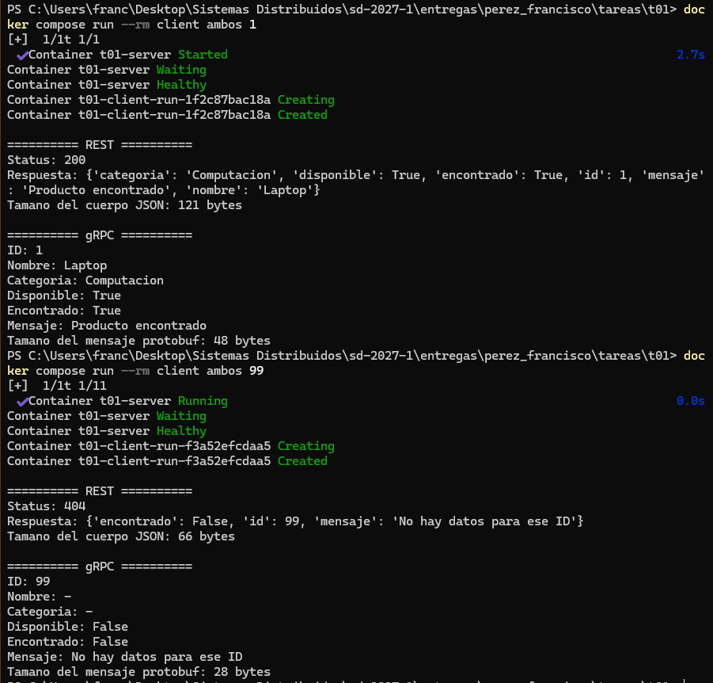

# T01 - El mismo servicio, por REST y por gRPC

## ¿Qué hace?

Esta tarea recibe el ID de un producto y devuelve la información . Si el ID no existe, responde que no hay datos. Los productos se guardan en un diccionario en memoria para mantener sencilla la lógica del servicio.

El servicio se puede consultar de dos formas:

* REST mediante HTTP y JSON. Utiliza el puerto `8080` dentro de Docker y el puerto `8081` desde la computadora.
* gRPC mediante Protocol Buffers, en el puerto `50051`.

Las dos formas de comunicación se ejecutan dentro del mismo programa servidor.

## Diseño y lógica compartida

La lógica se encuentra únicamente en `server/service.py`. Este archivo contiene el diccionario de productos y la función `buscar_producto()`, que recibe un ID y devuelve la información correspondiente o `None` si el producto no existe.

`server/rest_server.py` recibe la petición HTTP, llama a esa función y transforma el resultado en una respuesta JSON.

`server/grpc_server.py` recibe el mensaje definido en `proto/product.proto`, llama a la misma función y transforma el resultado en un mensaje protobuf.

Por lo tanto, REST y gRPC no repiten la búsqueda. Lo único que cambia es el controlador, el formato de los mensajes y el mecanismo de comunicación.

```text
Cliente -- REST --> rest_server.py --┐
                                      ├--> service.py --> diccionario
Cliente -- gRPC --> grpc_server.py --┘
```

Para REST se utilizó Flask y para gRPC se utilizaron las librerías `grpcio` y `grpcio-tools`.

## Puertos

| Servicio | Dentro de Docker | Desde la computadora |
| -------- | ---------------: | -------------------: |
| REST     |             8080 |                 8081 |
| gRPC     |            50051 |                50051 |

REST se publicó en el puerto `8081` de la computadora porque el puerto `8080` ya estaba ocupado. Dentro de la red de Docker, el servidor continúa utilizando el puerto `8080`.

## Estructura del proyecto

```text
t01/
├── proto/
│   └── product.proto
├── server/
│   ├── service.py
│   ├── rest_server.py
│   ├── grpc_server.py
│   ├── main.py
│   ├── requirements.txt
│   └── Dockerfile
├── client/
│   ├── client.py
│   ├── requirements.txt
│   └── Dockerfile
├── evidencia/
│   └── evidencia.png
├── .dockerignore
├── docker-compose.yml
└── README.md
```

Los archivos `product_pb2.py` y `product_pb2_grpc.py` no aparecen en la carpeta porque se generan automáticamente dentro de las imágenes de Docker a partir de `proto/product.proto`.

## Servicio

El diccionario contiene tres productos:

| ID | Nombre  | Categoría   | Disponible |
| -: | ------- | ----------- | ---------- |
|  1 | Laptop  | Computación | Sí         |
|  2 | Mouse   | Accesorios  | Sí         |
|  3 | Teclado | Accesorios  | No         |

Cuando el ID existe, ambas interfaces devuelven la información del mismo producto. Cuando el ID no existe, responden que no hay datos.

## ¿Cómo se ejecuta?

Todos los comandos se ejecutan desde la carpeta `t01`.

### 1. Construir las imágenes

```bash
docker compose build
```

### 2. Levantar el servidor

```bash
docker compose up -d server
```

### 3. Comprobar el estado del servidor

```bash
docker compose ps
```

El servidor debe aparecer con el estado `healthy`.

### 4. Consultar un ID existente por REST y gRPC

```bash
docker compose run --rm client ambos 1
```

REST devuelve un código `200` y gRPC indica que el producto fue encontrado.

### 5. Consultar un ID inexistente por REST y gRPC

```bash
docker compose run --rm client ambos 99
```

REST devuelve un código `404` y gRPC indica que el producto no fue encontrado.

El cliente también permite consultar solamente una interfaz:

```bash
docker compose run --rm client rest 2
docker compose run --rm client grpc 2
```

### 6. Consultar REST desde el navegador

Con el servidor encendido, se puede consultar el producto con ID `1` desde:

```text
http://localhost:8081/products/1
```

### 7. Ver los registros del servidor

```bash
docker compose logs server
```

### 8. Detener

```bash
docker compose down
```

Este comando detiene los contenedores y elimina la red creada por Docker, pero no borra los archivos del proyecto.

## Evidencia de ejecución

Se realizaron dos pruebas desde los contenedores de Docker:

* Una consulta con el ID `1`, que corresponde a un producto existente.
* Una consulta con el ID `99`, que no se encuentra en el diccionario.

En la primera prueba, REST devolvió el código `200` y gRPC indicó `Encontrado: True`. En la segunda, REST devolvió el código `404` y gRPC indicó `Encontrado: False`.



## Comparación de bytes

El cliente muestra automáticamente el tamaño del contenido de cada respuesta.

Para REST se utiliza:

```python
len(respuesta.content)
```

Esta instrucción mide el tamaño del cuerpo JSON recibido.

Para gRPC se utiliza:

```python
respuesta.ByteSize()
```

Esta instrucción obtiene el tamaño del mensaje protobuf serializado.

Los resultados obtenidos fueron:

| Consulta           | REST (JSON) | gRPC (protobuf) |
| ------------------ | ----------: | --------------: |
| ID 1, existente    |   121 bytes |        48 bytes |
| ID 99, inexistente |    66 bytes |        28 bytes |

Esta medición compara solamente el contenido de las respuestas. No incluye los encabezados HTTP, los encabezados de HTTP/2 ni otros datos agregados durante la comunicación.

En estas pruebas, protobuf ocupó menos espacio porque utiliza un formato binario y no necesita escribir los nombres de todos los campos como sucede con JSON.
