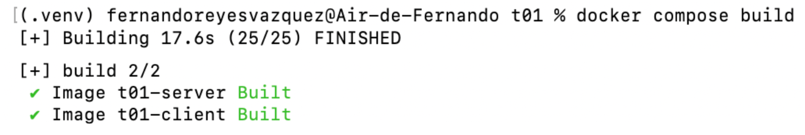
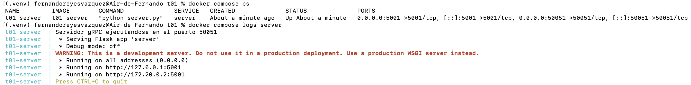
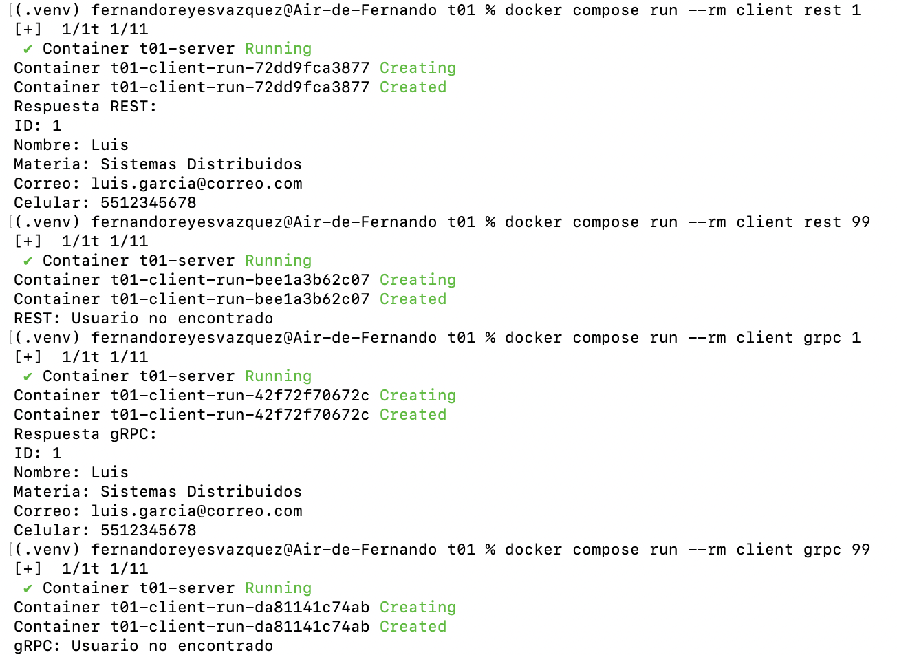
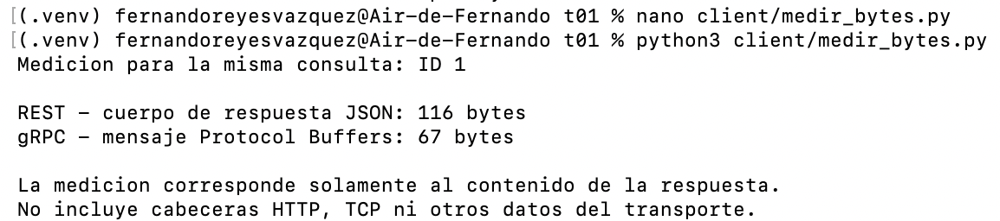

# Evidencia T01 - El mismo servicio por REST y por gRPC

En esta tarea se implementó un servicio para consultar información de usuarios por medio de dos interfaces: REST y gRPC. La lógica de negocio se mantuvo en un solo lugar, dentro del archivo `server/logic.py`, y tanto REST como gRPC utilizan esa misma lógica para buscar al usuario solicitado.

---

## 1. Construcción de las imágenes

Primero se construyeron las imágenes Docker del servidor y del cliente con el siguiente comando:

```bash
docker compose build
```

El proceso terminó correctamente y se generaron las dos imágenes necesarias para la tarea.



*Figura 1. Construcción correcta de las imágenes Docker del servidor y del cliente.*

---

## 2. Servidor y red de Docker

Después se inició únicamente el servidor con:

```bash
docker compose up -d server
```

Para verificar su estado se utilizaron los comandos:

```bash
docker compose ps
docker compose logs server
```

Con esto se comprobó que el contenedor `t01-server` quedó activo y que expone dos puertos:

- `5001` para la interfaz REST
- `50051` para la interfaz gRPC

En los logs también se observó que el mismo programa levantó Flask para REST y el servidor gRPC al mismo tiempo.



*Figura 2. Estado del servidor, puertos publicados y logs de ejecución de REST y gRPC.*

---

## 3. Pruebas de funcionamiento por REST y gRPC

Una vez levantado el servidor, se realizaron pruebas desde el contenedor cliente usando los siguientes comandos:

```bash
docker compose run --rm client rest 1
docker compose run --rm client rest 99
docker compose run --rm client grpc 1
docker compose run --rm client grpc 99
```

### 3.1 Consulta REST con usuario existente

La consulta:

```bash
docker compose run --rm client rest 1
```

devolvió correctamente la información del usuario con ID 1:

- ID: 1
- Nombre: Luis
- Materia: Sistemas Distribuidos
- Correo: luis.garcia@correo.com
- Celular: 5512345678

### 3.2 Consulta REST con usuario inexistente

La consulta:

```bash
docker compose run --rm client rest 99
```

respondió:

```text
REST: Usuario no encontrado
```

Esto indica que la interfaz REST maneja correctamente el caso en que el ID no existe.

### 3.3 Consulta gRPC con usuario existente

La consulta:

```bash
docker compose run --rm client grpc 1
```

devolvió la misma información del usuario con ID 1:

- ID: 1
- Nombre: Luis
- Materia: Sistemas Distribuidos
- Correo: luis.garcia@correo.com
- Celular: 5512345678

### 3.4 Consulta gRPC con usuario inexistente

La consulta:

```bash
docker compose run --rm client grpc 99
```

respondió:

```text
gRPC: Usuario no encontrado
```

Con esto se comprobó que la interfaz gRPC también maneja correctamente el caso en que el usuario no existe.



*Figura 3. Pruebas realizadas desde el contenedor cliente mediante REST y gRPC.*

---

## 4. Lógica compartida

La parte más importante de la tarea era que la lógica de negocio no estuviera duplicada. En este caso, la búsqueda del usuario se implementó una sola vez en el archivo:

```text
server/logic.py
```

Dentro de ese archivo se definió la función:

```python
def buscar_usuario(usuario_id):
    return USUARIOS.get(usuario_id)
```

Esa misma función es utilizada tanto por el controlador REST como por el controlador gRPC.

En REST, la ruta `/usuarios/<id>` recibe la solicitud HTTP, llama a `buscar_usuario()` y regresa la respuesta en formato JSON.

En gRPC, el método `ObtenerUsuario` recibe el ID mediante Protocol Buffers, llama igualmente a `buscar_usuario()` y devuelve la respuesta como un mensaje `UsuarioResponse`.

De esta forma, se cumple lo que pedía la tarea: un solo servicio con una sola lógica, expuesto por dos mecanismos distintos.

---

## 5. Punto extra: comparación del tamaño de la respuesta

Como punto extra, se realizó una comparación del tamaño de la información devuelta por REST y gRPC para la misma consulta.

Se utilizó el usuario con ID 1 y se ejecutó el siguiente programa:

```bash
python3 client/medir_bytes.py
```

El método de medición fue el siguiente:

- En REST se tomó el cuerpo de la respuesta JSON y se calculó su tamaño en bytes.
- En gRPC se tomó el mensaje `UsuarioResponse`, se serializó con Protocol Buffers y se calculó su tamaño en bytes.

Los resultados obtenidos fueron:

- REST: **116 bytes**
- gRPC: **67 bytes**

Esto muestra que, para esta misma consulta, el mensaje de gRPC fue más compacto que la respuesta JSON de REST.

Es importante aclarar que esta medición corresponde solamente al contenido de la respuesta. No incluye cabeceras HTTP, HTTP/2, TCP ni otros datos del transporte.

La diferencia se debe a que JSON representa tanto los nombres de los campos como sus valores en texto, mientras que Protocol Buffers utiliza una representación binaria más compacta.



*Figura 4. Medición del tamaño de la misma respuesta utilizando REST y gRPC.*

---

## 6. Resultado general

En esta tarea se logró implementar un mismo servicio expuesto por dos interfaces distintas: REST y gRPC.

Se comprobó que:

- el servidor funciona correctamente por REST;
- el servidor funciona correctamente por gRPC;
- el cliente puede consultar por ambos mecanismos;
- la lógica de negocio está compartida y no duplicada;
- el proyecto se puede construir y ejecutar con Docker y Docker Compose;
- y, como punto extra, se observó que la respuesta gRPC fue más compacta que la respuesta REST para la misma consulta.

En general, el proyecto cumple con los requisitos solicitados y permite comparar de forma práctica la diferencia entre exponer el mismo servicio por REST y por gRPC.
