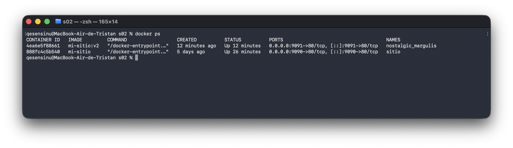

<h2>MISION 2:</h2>
        
El motivo por el cual no se actualiza el contenedor cuando se cambia el index es porque solo hacemos una
            copia de un momento exacto del index para el contenedor, si queremos que este se actualice debemos volver a
            crear la imagen y arrancar el contenedor de nuevo.

        <h2>MISION 3:</h2>

        

        