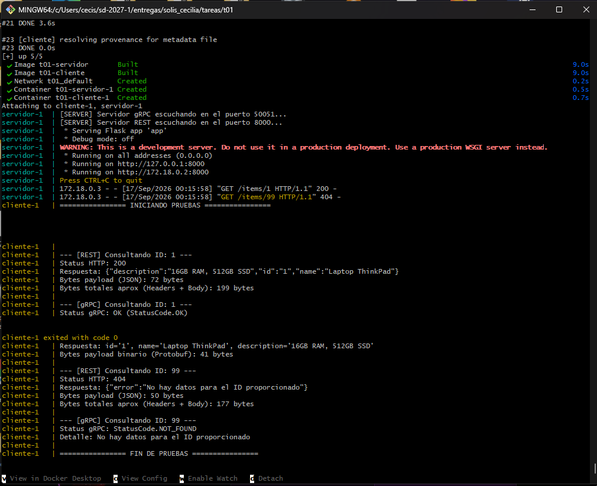

# T01: El mismo servicio, por REST y por gRPC

## 1. Diseno de la arquitectura
El servicio corre en un unico proceso servidor en Python para evitar duplicidad de logica:
* **Logica compartida:** La funcion `get_item_by_id(item_id)` consulta un diccionario en memoria (`DATABASE`).
* **Controlador REST:** Implementado con Flask en el puerto `8000`. Recibe peticiones HTTP GET, consulta la funcion compartida y retorna respuestas JSON con codigos HTTP adecuados (200 OK o 404 NOT FOUND).
* **Controlador gRPC:** Implementado con `grpcio` en el puerto `50051` utilizando el contrato definido en `proto/service.proto`. Consume exactamente la misma funcion `get_item_by_id` y responde con Protocol Buffers binarios o emite un estado `StatusCode.NOT_FOUND`.
* Ambos controladores se inician en el mismo archivo `app.py` utilizando hilos (`threading.Thread`).

## 2. Instrucciones para levantar el proyecto
Para compilar y ejecutar cliente y servidor conectados en red:
docker compose up --build
## 3. Evidencia de ejecucion
El contenedor cliente realiza pruebas automaticas consultando un registro existente (`ID: 1`) y uno inexistente (`ID: 99`) a traves de ambos protocolos, mostrando el status devuelto y el payload recibido.

## 4. Punto extra: Comparacion de bytes
Medicion realizada sobre la respuesta del recurso `ID: 1`:
* **REST (JSON):** 72 bytes de payload en el cuerpo JSON (199 bytes si se suman las cabeceras HTTP/1.1 en texto plano).
* **gRPC (Protobuf):** 41 bytes de payload binario serializado.

**Explicacion:**
REST utiliza JSON con cadenas en texto legible y nombres de atributos explicitos repetidos en cada mensaje, viajando sobre HTTP/1.1 con cabeceras de texto sin comprimir. Por el contrario, Protocol Buffers codifica cada campo utilizando identificadores numericos compactos (tags binarios) sin nombres de variables, y gRPC sobre HTTP/2 emplea multiplexacion y compresion de cabeceras via HPACK.