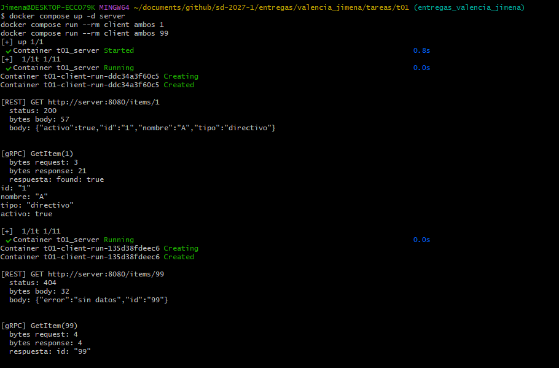

## T01 · El mismo servicio, por REST y por gRPC

## ¿Qué hace? 

Recibe un id devuelve la información asociada al mismo (nombre, tipo, si está
activo o no). Si este no existe, responde que no hay datos. Los datos viven
en un diccionario en memoria.

Este servicio se expone dos veces, por REST, con Flask, en el puerto 8080 y 
por gRPC, con la librería grpcio, en el puerto 50051. Las dos corren dentro del mismo programa, 
arrancado desde server/main.py

## ¿Dónde está la lógica?

El archivo server/service.py es la única parte del proyecto que
decide algo: busca el id en el diccionario y dice si existe o no. Recibe un 
id y regresa un resultado.

- server/rest_server.py es el controlador REST. recibe la petición
por HTTP, le pregunta a service.py, y devuelve la respuesta como JSON
con un código 200 (encontrado) o 404 (no encontrado).
- server/grpc_server.py es el controlador gRPC. recibe el mensaje
definido en proto/item.proto, le pregunta a la misma función de
service.py, y devuelve la respuesta como un mensaje protobuf.

Lo único que cambia entre los dos es cómo se empaqueta la respuesta y
por dónde viaja(texto JSON sobre HTTP y binario protobuf sobre gRPC).

La lógica que decide si el id existe está en un solo lugar, y ni REST ni gRPC la repiten.

## ¿Cómo se levanta?

```bash
docker compose build
docker compose up -d server
docker compose run --rm client ambos 1
docker compose run --rm client ambos 99
docker compose down
```

ambos significa que el cliente le llama al servidor primero por REST y
luego por gRPC. También se puede pedir solo uno sustituyendo ambos con rest o grpc.

## Estructura del proyecto.

```
t01/
├── proto/
│   └── item.proto              # contrato de gRPC
├── server/
│   ├── service.py               # lógica compartida
│   ├── rest_server.py           # controlador REST
│   ├── grpc_server.py           # controlador gRPC
│   ├── main.py                  # permite ejecutar los dos juntos
│   ├── item_pb2.py              # generado automáticamente del .proto
│   ├── item_pb2_grpc.py         # generado automáticamente del .proto
│   ├── requirements.txt
│   └── Dockerfile
├── client/
│   ├── client.py                # llama a REST y/o a gRPC
│   ├── item_pb2.py
│   ├── item_pb2_grpc.py
│   ├── requirements.txt
│   └── Dockerfile
├── docker-compose.yml
├── evidencia-docker.png
└── README.md
```

## Evidencia de ejecución

Corrida real en contenedores Docker, con el servidor y el cliente
comunicándose por la red interna (http://server:8080)



Los resultados son iguales a los que se obtienen corriendo el mismo
código fuera de Docker, directo en la máquina: eso confirma que la lógica
no cambió al contenerizar, solo el lugar donde corre.

## ¿Cuántos bytes viajan?

En el propio código del cliente. Para REST, con len(response.content) sobre la respuesta cruda que regresa la librería
requests. Para gRPC, con .ByteSize(), un método que traen los mensajes generados a partir del .proto y que reporta el tamaño exacto del mensaje ya serializado en binario.

Resultado con un id que existe (id=1)

| Interfaz | Bytes |
|---|---|
| REST (JSON) | 57 |
| gRPC (protobuf) | 21 |

Resultado con un id que no existe (id=99)

| Interfaz | Bytes |
|---|---|
| REST (JSON) | 32 |
| gRPC (protobuf) | 4 |

Protobuf pesa menos porque no manda los nombres de los campos además omite por completo cualquier campo que tenga su valor por defecto. En gRPC pesa solo 4 bytes, casi nada más que el id pedido, mientras que JSON siempre escribe cada campo de forma explícita, exista el dato o no.

En comparación con lo visto en clase, aquí el mensaje tiene varios campos, incluyendo texto, así que la comparación real depende de cuántos campos hay y 
qué tan largo es el contenido de cada uno.